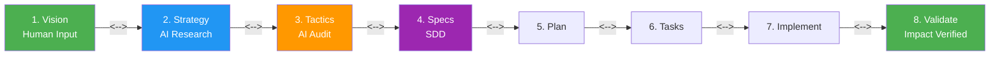

# Vision Driven Design

<a href="https://github.com/simonplmak-cloud/vision-driven-design/blob/main/LICENSE.md"></a>
<a href="https://github.com/simonplmak-cloud/vision-driven-design"></a>
<a href="https://github.com/simonplmak-cloud/vision-driven-design"></a>
<a href="https://github.com/simonplmak-cloud/vision-driven-design"></a>
<a href="https://opencode.ai/docs/skills/"></a>
<a href="https://github.com/simonplmak-cloud/vision-driven-design"></a>
<a href="https://github.com/simonplmak-cloud/vision-driven-design"></a>

**From vision to verified impact — an AI-native, fully autonomous software development methodology.**

VDD extends and absorbs Spec-Driven Development (SDD). Provide a human vision statement. The AI autonomously researches, audits your codebase, generates specs and plans, implements, and validates — with **bi-directional verification** at every junction to ensure nothing is missed or invented.

---



---

## Who Is This For?

- **Product teams** who want AI to drive development from a business goal, not a spec document
- **Solo developers** who have a vision but lack the bandwidth for research, planning, and specs
- **Open source maintainers** who need auditable traceability from vision to code
- **Webapp / data / ETL / infrastructure builders** whose projects span multiple technical domains
- **Anyone frustrated with SDD** because it starts at the spec level and doesn't connect to real-world impact

---

## Table of Contents

- [Quick Start](#quick-start)
- [How It Works](#how-it-works)
- [What Makes VDD Different](#what-makes-vdd-different)
- [Commands](#commands)
- [Installation](#installation)
- [Domains Covered](#domains-covered)
- [Documentation](#documentation)
- [Repository Structure](#repository-structure)
- [Credits](#credits)
- [License](#license)

---

## Quick Start

```bash
# One-line install (OpenCode)
git clone https://github.com/simonplmak-cloud/vision-driven-design.git \
  ~/.config/opencode/skills/vision-driven-design/
```

Then in your project:

```bash
/vdd:init                          # Generate project constitution (once)
/vdd:vision "your vision here"     # The only human input required
```

The AI takes over from here — researching markets, auditing your codebase, generating specs,
planning architecture, breaking down tasks, implementing feature by feature, and validating
impact — all with self-gating at 7 bi-directional verification junctions.

**[📖 Full Tutorial →](vdd/docs/tutorial.md)** — 30-minute walkthrough building a real project with VDD.

```bash
# Want human gates? Add to constitution.md:
## VDD Mode: gated
```

---

## How It Works

VDD follows Goldratt's **recursive Strategy-Tactic decomposition**: every phase is simultaneously
the **Tactic** for its parent and the **Strategy** for its child.

| Phase | S&T Role | Output |
|-------|----------|--------|
| **1. Vision** | L1 Strategy: What impact? | `vision.md` — Impact model, success metrics |
| **2. Strategy** | L1 Tactic → L2 Strategy | `strategy.md` — Research, pillars, risk register |
| **3. Tactics** | L2 Tactic → L3 Strategy | `tactics.md` — Codebase audit, action items |
| **4. Specs** | L3 Tactic → L4 Strategy | `spec.md` — MoSCoW acceptance criteria |
| **5. Plan** | L4 Tactic → L5 Strategy | `plan.md`, `data-model.md`, `contracts/` |
| **6. Tasks** | L5 Tactic → L6 Strategy | `tasks.md` — Test-first atomic tasks |
| **7. Implement** | L6 Tactic → L7 Strategy | Code — Per-task commits with full traceability |
| **8. Validate** | L7 Tactic — Did it work? | `impact-report.md` — Drift + impact verification |

**7 bi-directional gates** verify both directions at every junction (113 total checks).
Each gate also validates 4 S&T assumptions: Necessity, Achievability, Sufficiency, Warnings.

Every code commit traces back to the original vision statement through the full chain:
```
V-001 → S-002 → T-003 → SP-004 → PL-005 → TK-006 → commit
```

---

## What Makes VDD Different

| Feature | Traditional SDD | Vision Driven Design |
|---------|----------------|---------------------|
| **Starting point** | Spec document | Human vision statement |
| **Research** | Not included | 5 parallel research subagents (market, competitive, tech, impact, domain) |
| **Codebase awareness** | Not included | Full repository audit before spec generation |
| **Traceability** | Spec → Code | Vision → Strategy → Tactics → Spec → Plan → Code → Impact |
| **Verification** | Forward only | Bi-directional at every level (7 gates, 113 checks) |
| **Impact verification** | Not included | Leading + lagging metrics validated against vision |
| **Domain awareness** | Generic | 4 domain primers loaded automatically |
| **Autonomy** | Per-phase human gates | Full-auto mode — human provides vision only |

---

## Commands

| Command | What it does |
|---------|-------------|
| `/vdd:init` | Generate project constitution |
| `/vdd:vision "..."` | Expand freeform vision into structured impact model |
| `/vdd:strategize` | Research market, competitors, technology → strategic pillars |
| `/vdd:tactics` | Audit codebase → gap analysis → prioritized action items |
| `/vdd:specify <ID \| "desc">` | Generate acceptance criteria from action item or freeform |
| `/vdd:clarify <feature>` | Standalone clarification pass on a spec |
| `/vdd:plan <feature>` | Technical architecture, data model, API contracts |
| `/vdd:tasks <feature>` | Test-first task breakdown with dependencies |
| `/vdd:next-task <feature>` | Extract next uncompleted task |
| `/vdd:implement <ID>` | Execute single task, verify, commit |
| `/vdd:validate` | Full-chain traceability matrix + drift detection + impact report |
| `/vdd:trace` | Generate bidirectional traceability matrix |
| `/vdd:analyze` | Cross-artifact consistency and conflict analysis |
| `/vdd:amend` | Cascade requirement change through full chain |

---

## Installation

### OpenCode
```bash
git clone https://github.com/simonplmak-cloud/vision-driven-design.git \
  ~/.config/opencode/skills/vision-driven-design/
```

### Claude Code
```bash
git clone https://github.com/simonplmak-cloud/vision-driven-design.git \
  ~/.claude/skills/vision-driven-design/
```

### Cursor
```bash
git clone https://github.com/simonplmak-cloud/vision-driven-design.git \
  .cursor/skills/vision-driven-design/
```

---

## Domains Covered

VDD loads domain-specific research patterns during the Strategy phase based on your vision:

| Domain | What it covers |
|--------|---------------|
| **WebApp** | UX, accessibility (WCAG 2.2), performance budgets, framework evaluation |
| **Data Storage** | Schema design, indexing strategy, data governance, ACID vs eventual |
| **ETL** | Pipeline architecture, data quality frameworks, batch vs streaming |
| **Infrastructure** | CI/CD, observability, security, scaling, disaster recovery |

Each primer also includes **impact verification patterns** — how to prove real-world impact in that domain.

---

## Documentation

All reference docs live in `references/`:

| File | Contents |
|------|----------|
| [`workflow-phases.md`](references/workflow-phases.md) | Step-by-step for all 8 phases (authoritative) |
| [`artifact-templates.md`](references/artifact-templates.md) | Copy-paste templates for all 11 artifacts |
| [`prompt-patterns.md`](references/prompt-patterns.md) | AI prompts for generation + bidirectional gate verification |
| [`quality-gates.md`](references/quality-gates.md) | 7 gates with 113 checks + CI/CD integration |
| [`ai-agent-patterns.md`](references/ai-agent-patterns.md) | Multi-agent orchestration and auto-mode execution |
| [`anti-patterns.md`](references/anti-patterns.md) | 23 failure modes and fixes |
| [`traceability-matrix.md`](references/traceability-matrix.md) | RTM format + automated generation |
| [`quick-reference.md`](references/quick-reference.md) | One-page cheat sheet |

### Guides

- **[Getting Started Tutorial](vdd/docs/tutorial.md)** — 30-minute walkthrough building a real project
- **[VDD vs Alternatives](vdd/docs/comparison.md)** — VDD compared to SDD, vibe coding, and TDD
- **[Vision Canvas](vdd/docs/vision-canvas.md)** — 5-minute template for non-technical visionaries
- **[Dogfood Example](https://github.com/simonplmak-cloud/vdd-dogfood-task-tracker)** — Real project built with full VDD chain (vision→code)

---

## Repository Structure

```
├── SKILL.md                         # Entry point — loaded by OpenCode
├── AGENTS.md                        # Instructions for AI agents working on this repo
├── README.md                        # This file
├── CONTRIBUTING.md                  # How to contribute
├── LICENSE.md                       # MIT
├── domain-primers/                  # Domain research patterns (loaded during Strategy)
│   ├── webapp.md
│   ├── data-storage.md
│   ├── etl.md
│   └── infrastructure.md
└── references/                      # All reference documentation
    ├── INDEX.md                     # Navigation map
    ├── quick-reference.md           # 1-page cheat sheet
    ├── workflow-phases.md           # 8 phases step-by-step (authoritative)
    ├── artifact-templates.md        # 11 copy-paste templates (authoritative)
    ├── prompt-patterns.md           # All prompts + bidirectional gate verification
    ├── quality-gates.md             # 7 gates with 113 checks
    ├── ai-agent-patterns.md         # Multi-agent orchestration and auto-mode
    ├── anti-patterns.md             # 23 failure modes and fixes
    └── traceability-matrix.md       # RTM format + CI/CD automation
```

## Credits

Built on:
- **Goldratt's Strategy-and-Tactic Tree** — recursive decomposition at every phase
- **Impact Mapping** (Gojko Adzic) — goal → actors → impacts → deliverables
- **GitHub Spec Kit** — spec-driven development with AI agents
- **NASA Systems Engineering** — bidirectional traceability and verification chains
- **CMMI Requirements Management** — bidirectional traceability of requirements

## License

MIT — see [LICENSE.md](LICENSE.md)
